# Axon AI Serving

## Logical View (C4 Component Diagram)

### Milestone 01: Design Initial High-Level Architecture

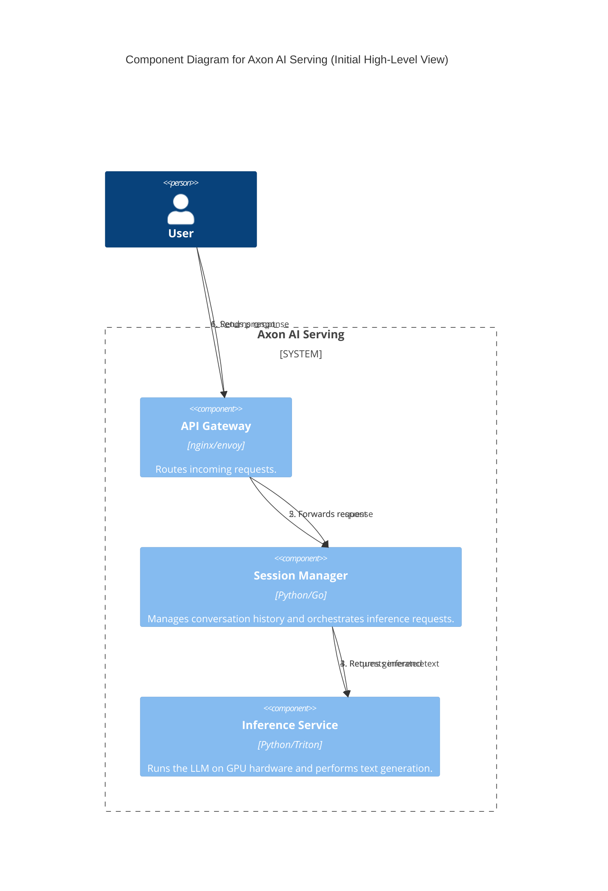
```mermaid
C4Component
    title Component Diagram for Axon AI Serving (Initial High-Level View)

    Person(user, "User")

    System_Boundary(c1, "Axon AI Serving") {
        Component(api_gateway, "API Gateway", "nginx/envoy", "Routes incoming requests.")
        Component(session_manager, "Session Manager", "Python/Go", "Manages conversation history and orchestrates inference requests.")
        Component(inference_service, "Inference Service", "Python/Triton", "Runs the LLM on GPU hardware and performs text generation.")
    }

    Rel(user, api_gateway, "1. Sends prompt")
    Rel(api_gateway, session_manager, "2. Forwards request")
    Rel(session_manager, inference_service, "3. Requests inference")
    Rel_Back(inference_service, session_manager, "4. Returns generated text")
    Rel_Back(session_manager, api_gateway, "5. Forwards response")
    Rel_Back(api_gateway, user, "6. Returns response")
```

### Milestone 02: Design Secure API Gateway with Rate Limiting

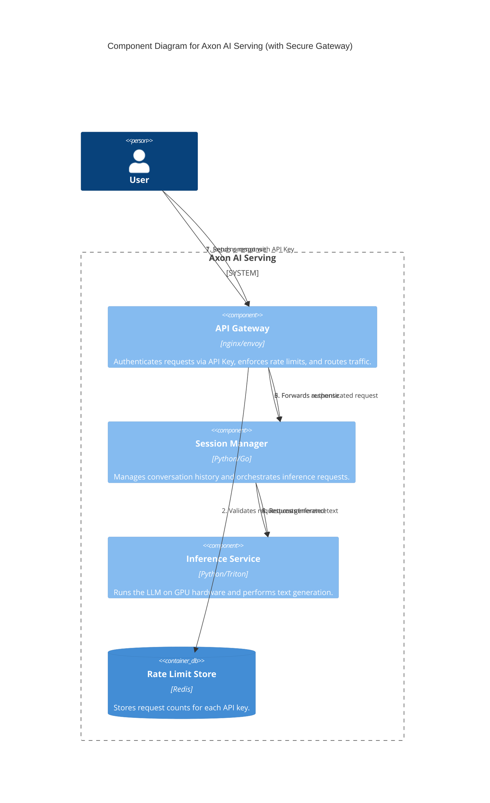
```mermaid
C4Component
    title Component Diagram for Axon AI Serving (with Secure Gateway)

    Person(user, "User")

    System_Boundary(c1, "Axon AI Serving") {
        Component(api_gateway, "API Gateway", "nginx/envoy", "Authenticates requests via API Key, enforces rate limits, and routes traffic.")
        Component(session_manager, "Session Manager", "Python/Go", "Manages conversation history and orchestrates inference requests.")
        Component(inference_service, "Inference Service", "Python/Triton", "Runs the LLM on GPU hardware and performs text generation.")

        ContainerDb(rate_limit_store, "Rate Limit Store", "Redis", "Stores request counts for each API key.")
    }

    Rel(user, api_gateway, "1. Sends prompt with API Key")
    Rel(api_gateway, rate_limit_store, "2. Validates request count")
    Rel(api_gateway, session_manager, "3. Forwards authenticated request")
    Rel(session_manager, inference_service, "4. Requests inference")
    Rel_Back(inference_service, session_manager, "5. Returns generated text")
    Rel_Back(session_manager, api_gateway, "6. Forwards response")
    Rel_Back(api_gateway, user, "7. Returns response")
```

### Milestone 03: Design Session Management with In-Memory Caching

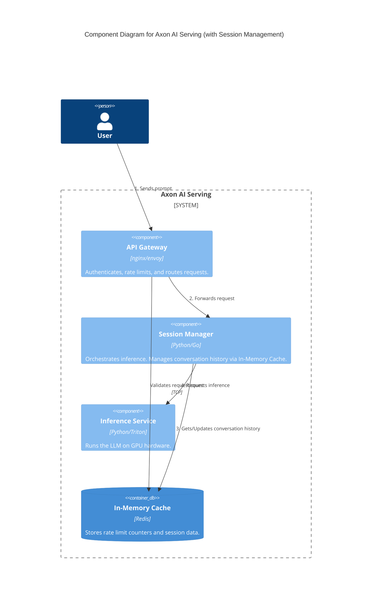
```mermaid
C4Component
    title Component Diagram for Axon AI Serving (with Session Management)

    Person(user, "User")

    System_Boundary(c1, "Axon AI Serving") {
        Component(api_gateway, "API Gateway", "nginx/envoy", "Authenticates, rate limits, and routes requests.")
        Component(session_manager, "Session Manager", "Python/Go", "Orchestrates inference. Manages conversation history via In-Memory Cache.")
        Component(inference_service, "Inference Service", "Python/Triton", "Runs the LLM on GPU hardware.")

        ContainerDb(in_memory_cache, "In-Memory Cache", "Redis", "Stores rate limit counters and session data.")
    }

    Rel(user, api_gateway, "1. Sends prompt")
    Rel(api_gateway, session_manager, "2. Forwards request")
    Rel(session_manager, in_memory_cache, "3. Gets/Updates conversation history")
    Rel(session_manager, inference_service, "4. Requests inference")
    
    Rel(api_gateway, in_memory_cache, "Validates request count", "TCP")
```

### Milestone 04: Design Decoupled Inference via a Message Queue

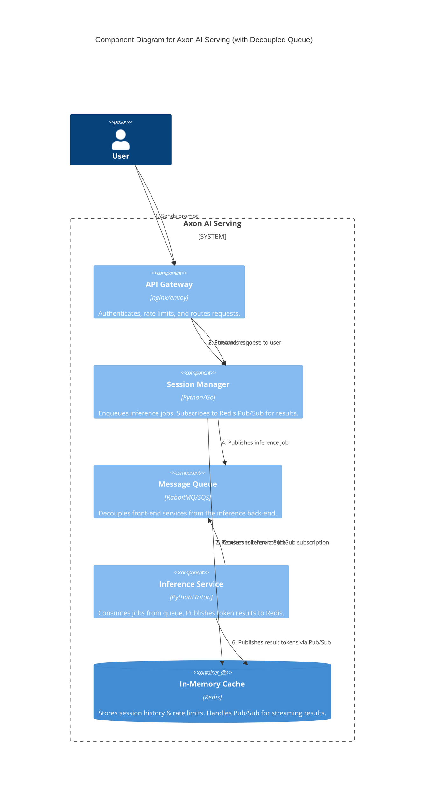
```mermaid
C4Component
    title Component Diagram for Axon AI Serving (with Decoupled Queue)

    Person(user, "User")

    System_Boundary(c1, "Axon AI Serving") {
        Component(api_gateway, "API Gateway", "nginx/envoy", "Authenticates, rate limits, and routes requests.")
        Component(session_manager, "Session Manager", "Python/Go", "Enqueues inference jobs. Subscribes to Redis Pub/Sub for results.")
        Component(message_queue, "Message Queue", "RabbitMQ/SQS", "Decouples front-end services from the inference back-end.")
        Component(inference_service, "Inference Service", "Python/Triton", "Consumes jobs from queue. Publishes token results to Redis.")

        ContainerDb(in_memory_cache, "In-Memory Cache", "Redis", "Stores session history & rate limits. Handles Pub/Sub for streaming results.")
    }

    Rel(user, api_gateway, "1. Sends prompt")
    Rel(api_gateway, session_manager, "2. Forwards request")
    Rel(session_manager, in_memory_cache, "3. Gets history")
    Rel(session_manager, message_queue, "4. Publishes inference job")

    Rel(inference_service, message_queue, "5. Consumes inference job")
    Rel(inference_service, in_memory_cache, "6. Publishes result tokens via Pub/Sub")
    Rel(session_manager, in_memory_cache, "7. Receives tokens via Pub/Sub subscription")

    Rel_Back(session_manager, api_gateway, "8. Streams response to user")
    Rel_Back(api_gateway, user, "")
```

### Milestone 05: Implement KV Cache Optimization in Inference Service

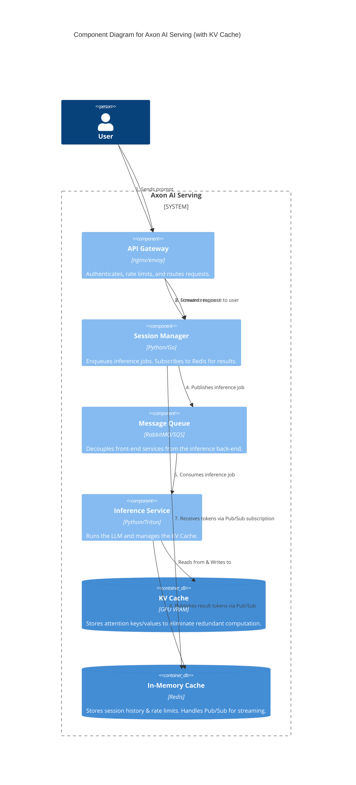
```mermaid
C4Component
    title Component Diagram for Axon AI Serving (with KV Cache)

    Person(user, "User")

    System_Boundary(c1, "Axon AI Serving") {
        Component(api_gateway, "API Gateway", "nginx/envoy", "Authenticates, rate limits, and routes requests.")
        Component(session_manager, "Session Manager", "Python/Go", "Enqueues inference jobs. Subscribes to Redis for results.")
        Component(message_queue, "Message Queue", "RabbitMQ/SQS", "Decouples front-end services from the inference back-end.")
        Component(inference_service, "Inference Service", "Python/Triton", "Runs the LLM and manages the KV Cache.")
        
        ContainerDb(kv_cache, "KV Cache", "GPU VRAM", "Stores attention keys/values to eliminate redundant computation.")
        ContainerDb(in_memory_cache, "In-Memory Cache", "Redis", "Stores session history & rate limits. Handles Pub/Sub for streaming.")
    }

    Rel(user, api_gateway, "1. Sends prompt")
    Rel(api_gateway, session_manager, "2. Forwards request")
    Rel(session_manager, in_memory_cache, "3. Gets history")
    Rel(session_manager, message_queue, "4. Publishes inference job")

    Rel(message_queue, inference_service, "5. Consumes inference job")
    Rel(inference_service, kv_cache, "Reads from & Writes to")

    Rel(inference_service, in_memory_cache, "6. Publishes result tokens via Pub/Sub")
    Rel(session_manager, in_memory_cache, "7. Receives tokens via Pub/Sub subscription")

    Rel_Back(session_manager, api_gateway, "8. Streams response to user")
    Rel_Back(api_gateway, user, "")
```

### Milestone 06: Design Throughput Maximization with Continuous Batching

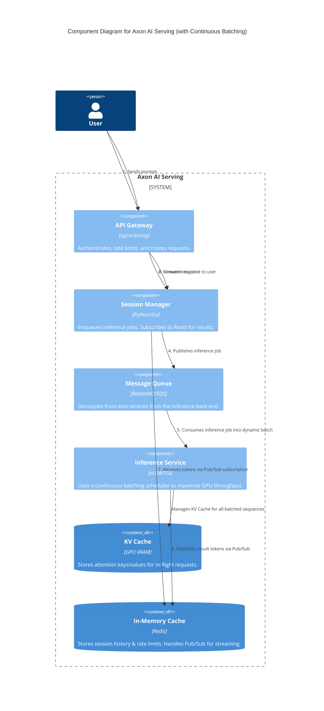
```mermaid
C4Component
    title Component Diagram for Axon AI Serving (with Continuous Batching)

    Person(user, "User")

    System_Boundary(c1, "Axon AI Serving") {
        Component(api_gateway, "API Gateway", "nginx/envoy", "Authenticates, rate limits, and routes requests.")
        Component(session_manager, "Session Manager", "Python/Go", "Enqueues inference jobs. Subscribes to Redis for results.")
        Component(message_queue, "Message Queue", "RabbitMQ/SQS", "Decouples front-end services from the inference back-end.")
        
        Component(inference_service, "Inference Service", "vLLM/TGI", "Uses a continuous batching scheduler to maximize GPU throughput.")
        
        ContainerDb(kv_cache, "KV Cache", "GPU VRAM", "Stores attention keys/values for in-flight requests.")
        ContainerDb(in_memory_cache, "In-Memory Cache", "Redis", "Stores session history & rate limits. Handles Pub/Sub for streaming.")
    }

    Rel(user, api_gateway, "1. Sends prompt")
    Rel(api_gateway, session_manager, "2. Forwards request")
    Rel(session_manager, in_memory_cache, "3. Gets history")
    Rel(session_manager, message_queue, "4. Publishes inference job")

    Rel(message_queue, inference_service, "5. Consumes inference job into dynamic batch")
    Rel(inference_service, kv_cache, "Manages KV Cache for all batched sequences")

    Rel(inference_service, in_memory_cache, "6. Publishes result tokens via Pub/Sub")
    Rel(session_manager, in_memory_cache, "7. Receives tokens via Pub/Sub subscription")

    Rel_Back(session_manager, api_gateway, "8. Streams response to user")
    Rel_Back(api_gateway, user, "")
```

### Milestone 07: Design Data Persistence with a Write-Ahead Log (WAL)

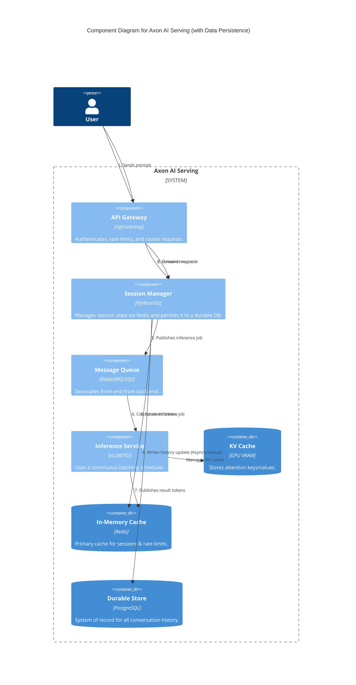
```mermaid
C4Component
    title Component Diagram for Axon AI Serving (with Data Persistence)

    Person(user, "User")

    System_Boundary(c1, "Axon AI Serving") {
        Component(api_gateway, "API Gateway", "nginx/envoy", "Authenticates, rate limits, and routes requests.")
        Component(session_manager, "Session Manager", "Python/Go", "Manages session state via Redis and persists it to a durable DB.")
        Component(message_queue, "Message Queue", "RabbitMQ/SQS", "Decouples front-end from back-end.")
        Component(inference_service, "Inference Service", "vLLM/TGI", "Uses a continuous batching scheduler.")
        
        ContainerDb(kv_cache, "KV Cache", "GPU VRAM", "Stores attention keys/values.")
        ContainerDb(in_memory_cache, "In-Memory Cache", "Redis", "Primary cache for sessions & rate limits.")
        ContainerDb(durable_store, "Durable Store", "PostgreSQL", "System of record for all conversation history.")
    }
    
    Rel(user, api_gateway, "1. Sends prompt")
    Rel(api_gateway, session_manager, "2. Forwards request")
    Rel(session_manager, in_memory_cache, "3. Gets/Updates session cache (Synchronous)")
    Rel(session_manager, durable_store, "4. Writes history update (Asynchronous)")
    Rel(session_manager, message_queue, "5. Publishes inference job")

    Rel(message_queue, inference_service, "6. Consumes inference job")
    Rel(inference_service, kv_cache, "Manages KV Cache")
    Rel(inference_service, in_memory_cache, "7. Publishes result tokens")

    Rel(session_manager, in_memory_cache, "8. Receives tokens")
    Rel_Back(session_manager, api_gateway, "9. Streams response")
    Rel_Back(api_gateway, user, "")
```

### Milestone 08: Design Support for Large Models with Tensor Parallelism

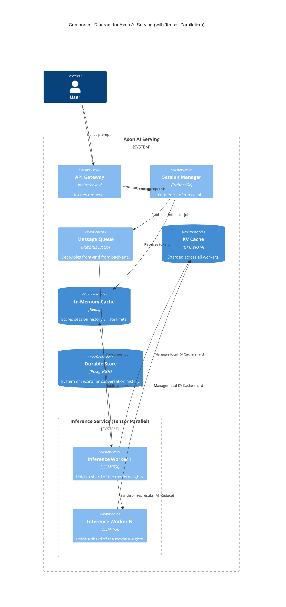
```mermaid
C4Component
    title Component Diagram for Axon AI Serving (with Tensor Parallelism)

    Person(user, "User")

    System_Boundary(c1, "Axon AI Serving") {
        Component(api_gateway, "API Gateway", "nginx/envoy", "Routes requests.")
        Component(session_manager, "Session Manager", "Python/Go", "Enqueues inference jobs.")
        Component(message_queue, "Message Queue", "RabbitMQ/SQS", "Decouples front-end from back-end.")
        
        System_Boundary(c2, "Inference Service (Tensor Parallel)") {
             Component(worker_1, "Inference Worker 1", "vLLM/TGI", "Holds a shard of the model weights.")
             Component(worker_n, "Inference Worker N", "vLLM/TGI", "Holds a shard of the model weights.")
        }

        ContainerDb(kv_cache, "KV Cache", "GPU VRAM", "Sharded across all workers.")
        ContainerDb(in_memory_cache, "In-Memory Cache", "Redis", "Stores session history & rate limits.")
        ContainerDb(durable_store, "Durable Store", "PostgreSQL", "System of record for conversation history.")
    }
    
    Rel(user, api_gateway, "Sends prompt")
    Rel(api_gateway, session_manager, "Forwards request")
    Rel(session_manager, message_queue, "Publishes inference job")

    Rel(message_queue, worker_1, "Consumes job")
    Rel(worker_1, worker_n, "Synchronizes results (All-Reduce)")

    Rel(worker_1, kv_cache, "Manages local KV Cache shard")
    Rel(worker_n, kv_cache, "Manages local KV Cache shard")

    Rel(worker_1, in_memory_cache, "Publishes result tokens")

    Rel(session_manager, in_memory_cache, "Receives tokens")
    Rel_Back(session_manager, api_gateway, "Streams response")
    Rel_Back(api_gateway, user, "")
```

### Milestone 09: Finalize Production Deployment View with High Availability and Observability

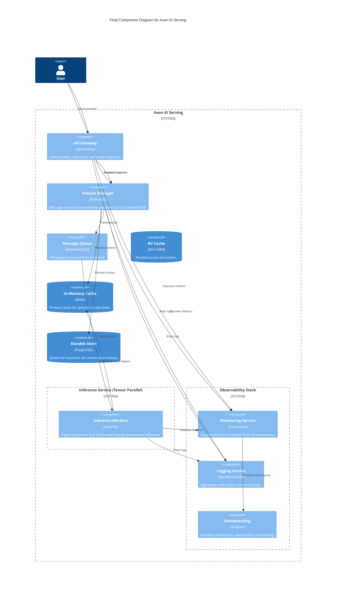
```mermaid
C4Component
    title Final Component Diagram for Axon AI Serving

    Person(user, "User")

    System_Boundary(c1, "Axon AI Serving") {
        Component(api_gateway, "API Gateway", "nginx/envoy", "Authenticates, rate limits, and routes requests.")
        Component(session_manager, "Session Manager", "Python/Go", "Manages session state via Redis and persists it to a durable DB.")
        Component(message_queue, "Message Queue", "RabbitMQ/SQS", "Decouples front-end from back-end.")
        
        System_Boundary(c2, "Inference Service (Tensor Parallel)") {
             Component(worker, "Inference Workers", "vLLM/TGI", "A pool of workers that hold model shards and execute inference.")
        }

        ContainerDb(kv_cache, "KV Cache", "GPU VRAM", "Sharded across all workers.")
        ContainerDb(in_memory_cache, "In-Memory Cache", "Redis", "Primary cache for sessions & rate limits.")
        ContainerDb(durable_store, "Durable Store", "PostgreSQL", "System of record for all conversation history.")

        System_Boundary(c3, "Observability Stack") {
            Component(monitoring, "Monitoring Service", "Prometheus", "Scrapes and stores metrics from all components.")
            Component(logging, "Logging Service", "OpenSearch/Loki", "Aggregates and indexes structured logs.")
            Component(dashboarding, "Dashboarding", "Grafana", "Provides visualization, dashboards, and alerting.")
        }
    }
    
    Rel(user, api_gateway, "Sends prompt")
    Rel(api_gateway, session_manager, "Forwards request")
    Rel(session_manager, message_queue, "Publishes job")
    Rel(message_queue, worker, "Consumes job")
    Rel(worker, in_memory_cache, "Publishes result tokens")
    Rel(session_manager, in_memory_cache, "Receives tokens")
    Rel(session_manager, durable_store, "Persists history")
    
    Rel_Back(session_manager, api_gateway, "Streams response")
    Rel_Back(api_gateway, user, "")

    Rel(api_gateway, monitoring, "Exposes /metrics")
    Rel(session_manager, monitoring, "Exposes /metrics")
    Rel(worker, monitoring, "Exposes /metrics")
    Rel(monitoring, dashboarding, "Provides data source")

    Rel(api_gateway, logging, "Ships logs")
    Rel(session_manager, logging, "Ships logs")
    Rel(worker, logging, "Ships logs")
```

## Physical View (AWS Deployment Diagram)

### Milestone 01: Design Initial High-Level Architecture

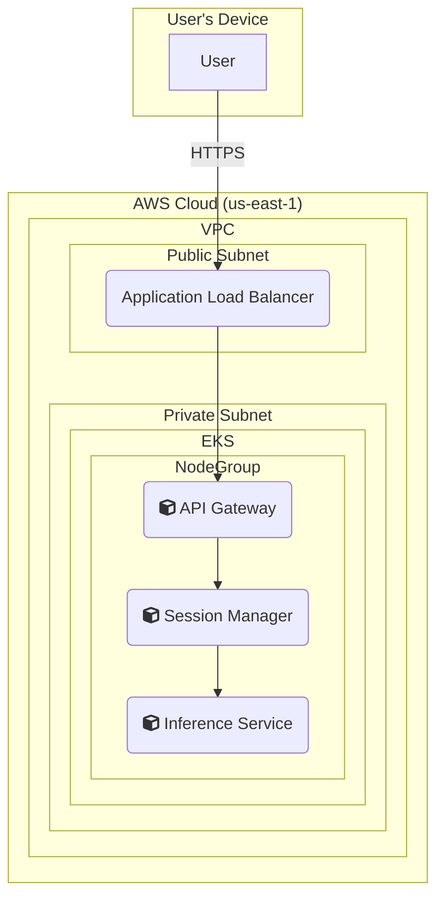
```mermaid
graph TD
    subgraph "User's Device"
        U[User]
    end

    subgraph "AWS Cloud (us-east-1)"
        VPC("VPC")
        subgraph VPC
            subgraph "Public Subnet"
                ALB("Application Load Balancer");
            end

            subgraph "Private Subnet"
                EKS("EKS Cluster");
            end
        end

        subgraph EKS
            NodeGroup("EKS Node Group")
            subgraph NodeGroup
                Container1(fa:fa-cube API Gateway);
                Container2(fa:fa-cube Session Manager);
                Container3(fa:fa-cube Inference Service);
            end
        end
    end

    U -- HTTPS --> ALB;
    ALB --> Container1;
    Container1 --> Container2;
    Container2 --> Container3;
```

### Milestone 02: Design Secure API Gateway with Rate Limiting

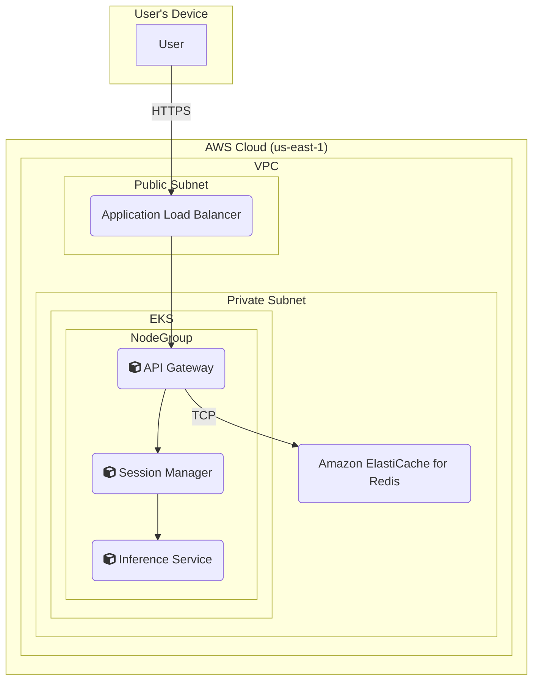
```mermaid
graph TD
    subgraph "User's Device"
        U[User]
    end

    subgraph "AWS Cloud (us-east-1)"
        VPC("VPC")
        subgraph VPC
            subgraph "Public Subnet"
                ALB("Application Load Balancer");
            end

            subgraph "Private Subnet"
                EKS("EKS Cluster");
                ElastiCache("Amazon ElastiCache for Redis");
            end
        end

        subgraph EKS
            NodeGroup("EKS Node Group")
            subgraph NodeGroup
                Container1(fa:fa-cube API Gateway);
                Container2(fa:fa-cube Session Manager);
                Container3(fa:fa-cube Inference Service);
            end
        end
    end

    U -- HTTPS --> ALB;
    ALB --> Container1;
    Container1 --> Container2;
    Container2 --> Container3;
    
    Container1 -- TCP --> ElastiCache;
```

### Milestone 03: Design Session Management with In-Memory Caching

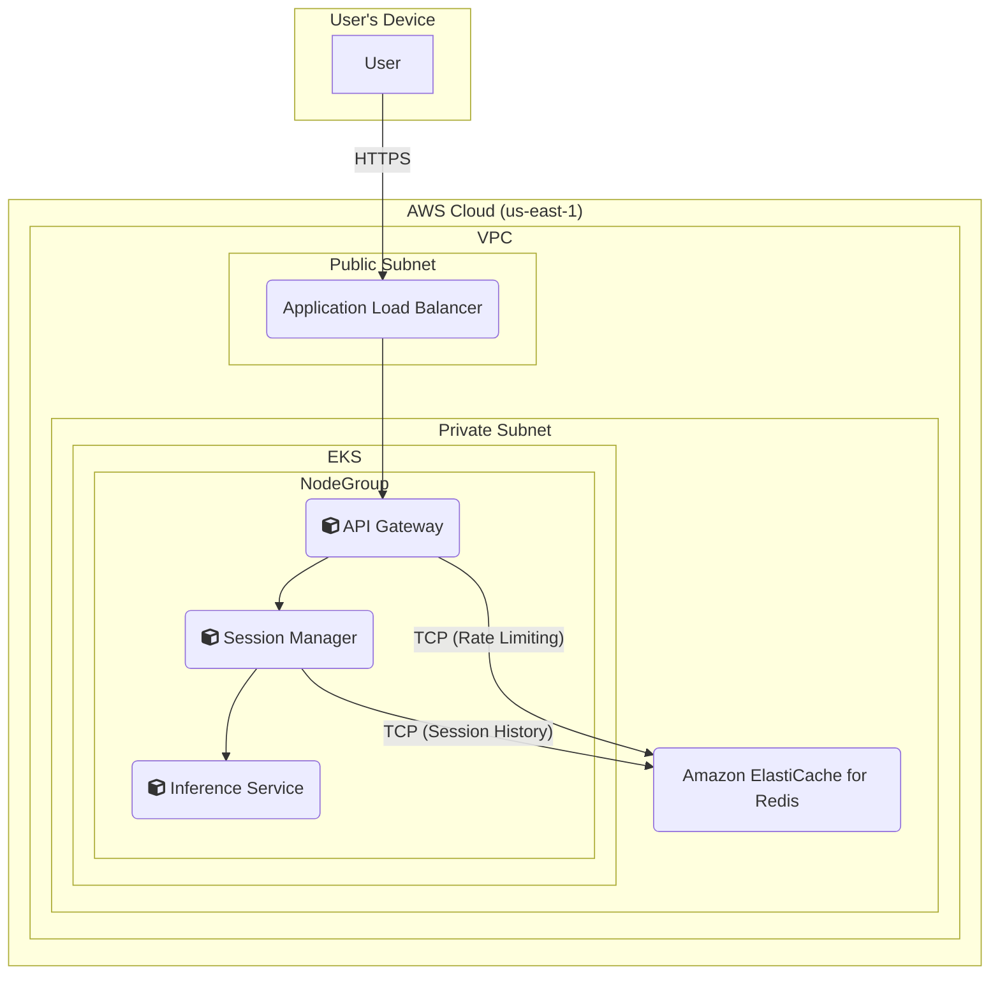
```mermaid
graph TD
    subgraph "User's Device"
        U[User]
    end

    subgraph "AWS Cloud (us-east-1)"
        VPC("VPC")
        subgraph VPC
            subgraph "Public Subnet"
                ALB("Application Load Balancer");
            end

            subgraph "Private Subnet"
                EKS("EKS Cluster");
                ElastiCache("Amazon ElastiCache for Redis");
            end
        end

        subgraph EKS
            NodeGroup("EKS Node Group")
            subgraph NodeGroup
                Container1(fa:fa-cube API Gateway);
                Container2(fa:fa-cube Session Manager);
                Container3(fa:fa-cube Inference Service);
            end
        end
    end

    U -- HTTPS --> ALB;
    ALB --> Container1;
    Container1 --> Container2;
    Container2 --> Container3;
    
    Container1 -- "TCP (Rate Limiting)" --> ElastiCache;
    Container2 -- "TCP (Session History)" --> ElastiCache;
```

### Milestone 04: Design Decoupled Inference via a Message Queue

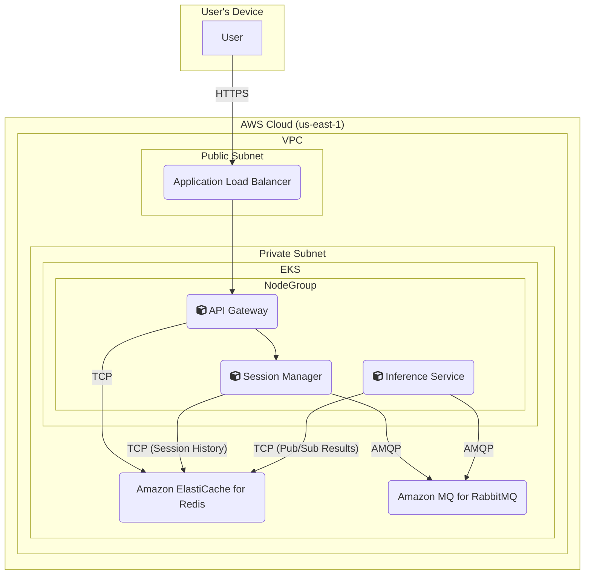
```mermaid
graph TD
    subgraph "User's Device"
        U[User]
    end

    subgraph "AWS Cloud (us-east-1)"
        VPC("VPC")
        subgraph VPC
            subgraph "Public Subnet"
                ALB("Application Load Balancer");
            end

            subgraph "Private Subnet"
                EKS("EKS Cluster");
                ElastiCache("Amazon ElastiCache for Redis");
                MQ("Amazon MQ for RabbitMQ");
            end
        end

        subgraph EKS
            NodeGroup("EKS Node Group")
            subgraph NodeGroup
                Container1(fa:fa-cube API Gateway);
                Container2(fa:fa-cube Session Manager);
                Container3(fa:fa-cube Inference Service);
            end
        end
    end

    U -- HTTPS --> ALB;
    ALB --> Container1;
    Container1 --> Container2;
    
    Container1 -- "TCP" --> ElastiCache;
    Container2 -- "TCP (Session History)" --> ElastiCache;
    Container3 -- "TCP (Pub/Sub Results)" --> ElastiCache;

    Container2 -- "AMQP" --> MQ;
    Container3 -- "AMQP" --> MQ;
```

### Milestone 05: Implement KV Cache Optimization in Inference Service

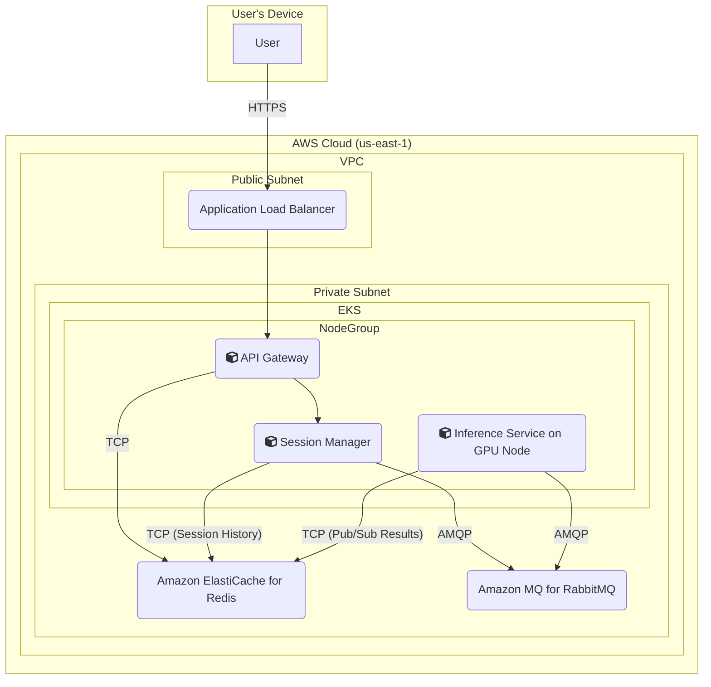
```mermaid
graph TD
    subgraph "User's Device"
        U[User]
    end

    subgraph "AWS Cloud (us-east-1)"
        VPC("VPC")
        subgraph VPC
            subgraph "Public Subnet"
                ALB("Application Load Balancer");
            end

            subgraph "Private Subnet"
                EKS("EKS Cluster");
                ElastiCache("Amazon ElastiCache for Redis");
                MQ("Amazon MQ for RabbitMQ");
            end
        end

        subgraph EKS
            NodeGroup("EKS Node Group")
            subgraph NodeGroup
                Container1(fa:fa-cube API Gateway);
                Container2(fa:fa-cube Session Manager);
                Container3(fa:fa-cube Inference Service on GPU Node);
            end
        end
    end

    U -- HTTPS --> ALB;
    ALB --> Container1;
    Container1 --> Container2;
    
    Container1 -- "TCP" --> ElastiCache;
    Container2 -- "TCP (Session History)" --> ElastiCache;
    Container3 -- "TCP (Pub/Sub Results)" --> ElastiCache;

    Container2 -- "AMQP" --> MQ;
    Container3 -- "AMQP" --> MQ;
```

### Milestone 06: Design Throughput Maximization with Continuous Batching

```mermaid
graph TD
    subgraph "User's Device"
        U[User]
    end

    subgraph "AWS Cloud (us-east-1)"
        VPC("VPC")
        subgraph VPC
            subgraph "Public Subnet"
                ALB("Application Load Balancer");
            end

            subgraph "Private Subnet"
                EKS("EKS Cluster");
                ElastiCache("Amazon ElastiCache for Redis");
                MQ("Amazon MQ for RabbitMQ");
            end
        end

        subgraph EKS
            NodeGroup("EKS Node Group")
            subgraph NodeGroup
                Container1(fa:fa-cube API Gateway);
                Container2(fa:fa-cube Session Manager);
                Container3(fa:fa-cube Inference Service on GPU Node);
            end
        end
    end

    U -- HTTPS --> ALB;
    ALB --> Container1;
    Container1 --> Container2;
    
    Container1 -- "TCP" --> ElastiCache;
    Container2 -- "TCP (Session History)" --> ElastiCache;
    Container3 -- "TCP (Pub/Sub Results)" --> ElastiCache;

    Container2 -- "AMQP" --> MQ;
    Container3 -- "AMQP" --> MQ;
```

### Milestone 07: Design Data Persistence with a Write-Ahead Log (WAL)

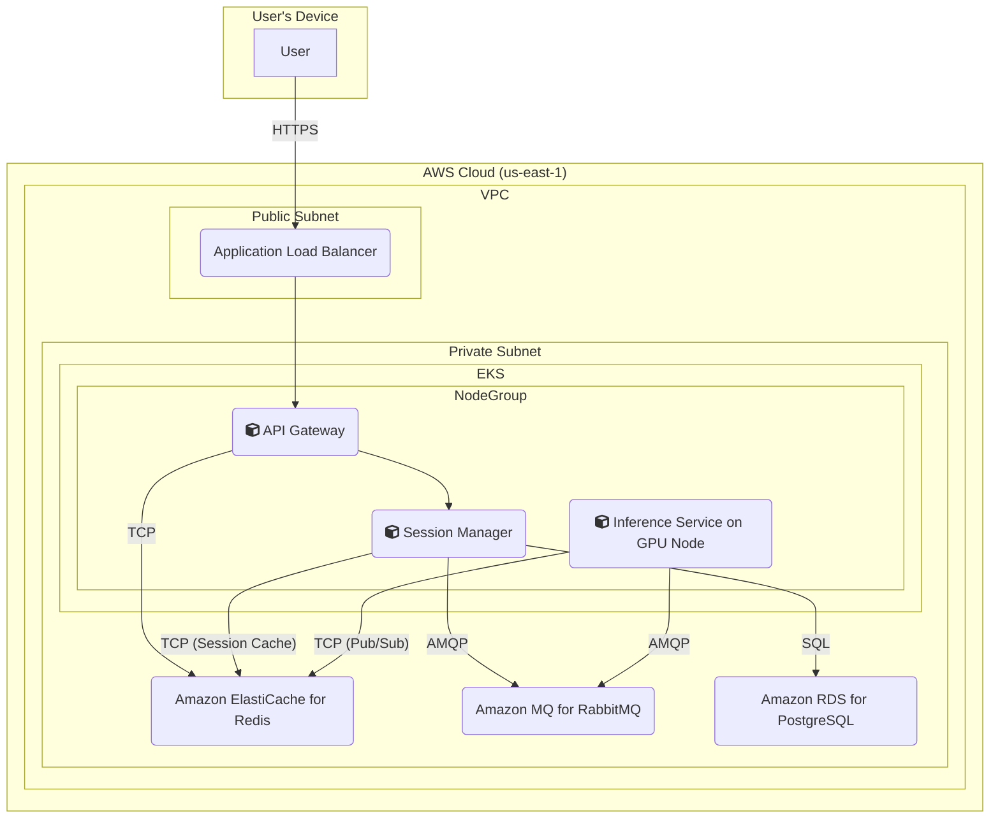
```mermaid
graph TD
    subgraph "User's Device"
        U[User]
    end

    subgraph "AWS Cloud (us-east-1)"
        VPC("VPC")
        subgraph VPC
            subgraph "Public Subnet"
                ALB("Application Load Balancer");
            end

            subgraph "Private Subnet"
                EKS("EKS Cluster");
                ElastiCache("Amazon ElastiCache for Redis");
                MQ("Amazon MQ for RabbitMQ");
                RDS("Amazon RDS for PostgreSQL");
            end
        end

        subgraph EKS
            NodeGroup("EKS Node Group")
            subgraph NodeGroup
                Container1(fa:fa-cube API Gateway);
                Container2(fa:fa-cube Session Manager);
                Container3(fa:fa-cube Inference Service on GPU Node);
            end
        end
    end

    U -- HTTPS --> ALB;
    ALB --> Container1;
    Container1 --> Container2;
    
    Container1 -- "TCP" --> ElastiCache;
    Container2 -- "TCP (Session Cache)" --> ElastiCache;
    Container3 -- "TCP (Pub/Sub)" --> ElastiCache;

    Container2 -- "AMQP" --> MQ;
    Container3 -- "AMQP" --> MQ;
    
    Container2 -- "SQL" --> RDS;
```

### Milestone 08: Design Support for Large Models with Tensor Parallelism

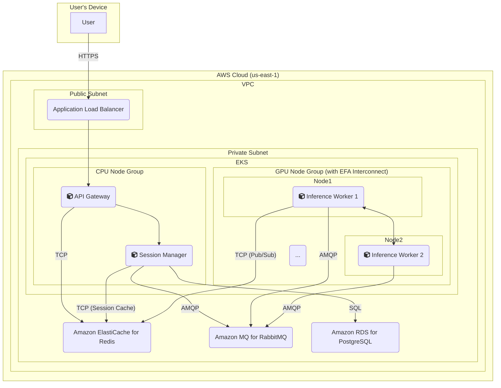
```mermaid
graph TD
    subgraph "User's Device"
        U[User]
    end

    subgraph "AWS Cloud (us-east-1)"
        VPC("VPC")
        subgraph VPC
            subgraph "Public Subnet"
                ALB("Application Load Balancer");
            end

            subgraph "Private Subnet"
                EKS("EKS Cluster");
                ElastiCache("Amazon ElastiCache for Redis");
                MQ("Amazon MQ for RabbitMQ");
                RDS("Amazon RDS for PostgreSQL");
            end
        end

        subgraph EKS
            subgraph "CPU Node Group"
                Container1(fa:fa-cube API Gateway);
                Container2(fa:fa-cube Session Manager);
            end
            
            subgraph "GPU Node Group (with EFA Interconnect)"
                Node1("GPU Node 1 (p4d.24xlarge)")
                Node2("GPU Node 2 (p4d.24xlarge)")
                NodeN("...")
                
                subgraph Node1
                    IW1("fa:fa-cube Inference Worker 1")
                end
                subgraph Node2
                    IW2("fa:fa-cube Inference Worker 2")
                end
                
                IW1 <--> IW2
            end
        end
    end

    U -- HTTPS --> ALB;
    ALB --> Container1;
    Container1 --> Container2;
    
    Container1 -- "TCP" --> ElastiCache;
    Container2 -- "TCP (Session Cache)" --> ElastiCache;
    IW1 -- "TCP (Pub/Sub)" --> ElastiCache;

    Container2 -- "AMQP" --> MQ;
    IW1 -- "AMQP" --> MQ;
    IW2 -- "AMQP" --> MQ;
    
    Container2 -- "SQL" --> RDS;
```

### Milestone 09: Finalize Production Deployment View with High Availability and Observability

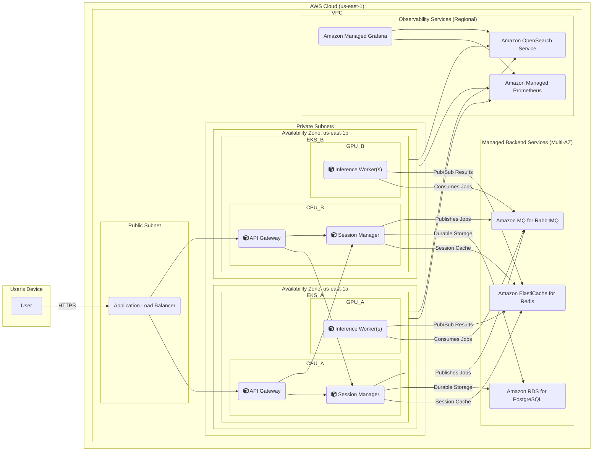
```mermaid
graph LR
    subgraph User's Device
        U[User]
    end

    subgraph "AWS Cloud (us-east-1)"
        VPC("VPC")
        subgraph VPC
            subgraph Public Subnet
                ALB("Application Load Balancer");
            end

            subgraph Private Subnets
                subgraph "Availability Zone: us-east-1a"
                    EKS_A("EKS Cluster AZ-a");
                    subgraph EKS_A
                        CPU_A("CPU Node Group A");
                        GPU_A("GPU Node Group A (with EFA)");
                    end
                end

                subgraph "Availability Zone: us-east-1b"
                    EKS_B("EKS Cluster AZ-b");
                    subgraph EKS_B
                        CPU_B("CPU Node Group B");
                        GPU_B("GPU Node Group B (with EFA)");
                    end
                end
            end

            subgraph "Managed Backend Services (Multi-AZ)"
                RDS("Amazon RDS for PostgreSQL");
                ElastiCache("Amazon ElastiCache for Redis");
                MQ("Amazon MQ for RabbitMQ");
            end
            
            subgraph "Observability Services (Regional)"
                AMP("Amazon Managed Prometheus");
                AOS("Amazon OpenSearch Service");
                AMG("Amazon Managed Grafana");
            end
        end
    end

    %% Define Node Contents %%
    subgraph CPU_A
        Container1_A(fa:fa-cube API Gateway);
        Container2_A(fa:fa-cube Session Manager);
    end
    subgraph GPU_A
        IW_A("fa:fa-cube Inference Worker(s)");
    end
    subgraph CPU_B
        Container1_B(fa:fa-cube API Gateway);
        Container2_B(fa:fa-cube Session Manager);
    end
    subgraph GPU_B
        IW_B("fa:fa-cube Inference Worker(s)");
    end

    %% Define Connections %%
    U -- HTTPS --> ALB;
    ALB --> Container1_A & Container1_B;
    
    Container1_A & Container1_B --> Container2_A & Container2_B;
    
    Container2_A & Container2_B -- "Session Cache" --> ElastiCache;
    Container2_A & Container2_B -- "Durable Storage" --> RDS;
    Container2_A & Container2_B -- "Publishes Jobs" --> MQ;
    
    IW_A & IW_B -- "Consumes Jobs" --> MQ;
    IW_A & IW_B -- "Pub/Sub Results" --> ElastiCache;

    %% Observability Connections %%
    EKS_A & EKS_B --> AMP;
    EKS_A & EKS_B --> AOS;
    AMG --> AMP & AOS;
```
