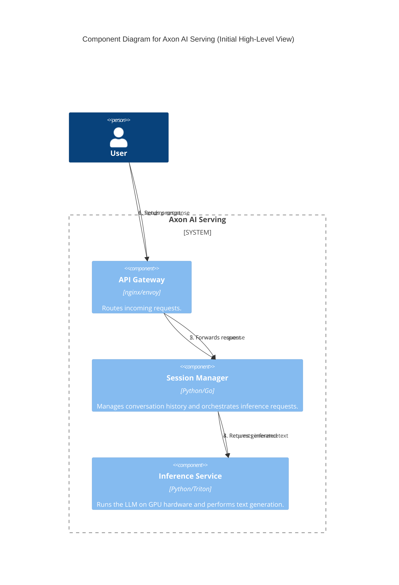
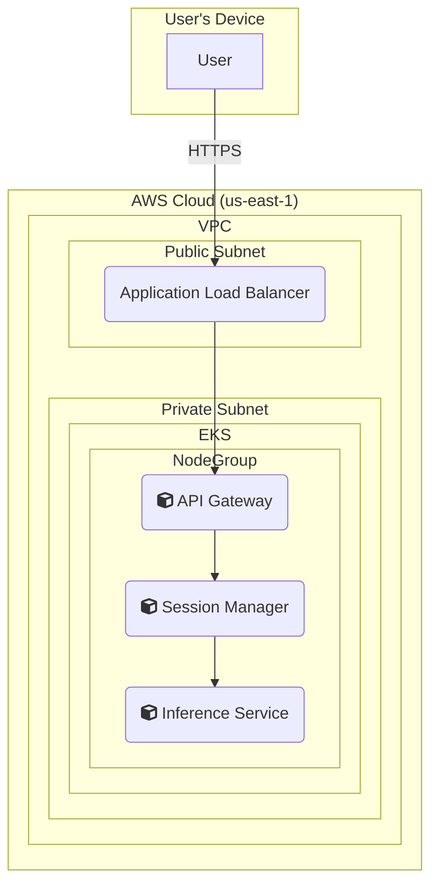

### **Design Initial High-Level Architecture**

*   **Problem:** Before diving into specific implementation details, we need a foundational "walking skeleton" of the system. This initial design establishes the core logical components and their primary interaction patterns for handling a single user request.
*   **Solution:** Define a high-level architecture with four main logical components:
    1.  **API Gateway:** The single entry point for all client requests.
    2.  **Session Manager:** A service that interprets the client's request and manages conversation context.
    3.  **Inference Service:** The core component that runs the LLM model on GPU hardware to generate a response.
    4.  **Client:** The end-user application making the request.
    This initial design will model a simple, synchronous request-response flow.
*   **Trade-offs:**
    *   **Pros:** Simple to understand and provides a clear separation of concerns from the start. It serves as a solid foundation for all future enhancements.
    *   **Cons:** This initial design is naive and not yet production-ready. It lacks a decoupling mechanism (like a message queue), making it vulnerable to backpressure. The synchronous flow will lead to high user-facing latency. Scalability and fault tolerance are not yet addressed.

#### Logical View (C4 Component Diagram)

This diagram shows the main logical components and the flow of a request. The user sends a prompt, which goes through the gateway to the Session Manager. The Session Manager, after handling context, forwards the request to the Inference Service, which returns the generated text back along the same path.

#### Physical View (AWS Deployment Diagram)

This diagram maps our logical components to a high-level physical infrastructure. For this initial stage, all our custom services are containerized and will run within a managed Kubernetes cluster (Amazon EKS).

#### Component-to-Resource Mapping Table

| Logical Component   | Physical Resource                               | Rationale                                                                                             |
| ------------------- | ----------------------------------------------- | ----------------------------------------------------------------------------------------------------- |
| API Gateway         | Container in EKS Cluster                        | Containerization provides portability. Sits behind a Load Balancer to handle ingress traffic.           |
| Session Manager     | Container in EKS Cluster                        | A stateless service ideal for containerization. Can be scaled independently of other components.      |
| Inference Service   | Container in EKS Cluster (on GPU-enabled nodes) | Requires GPU access. Containerization allows packaging the model, dependencies, and inference server. |
