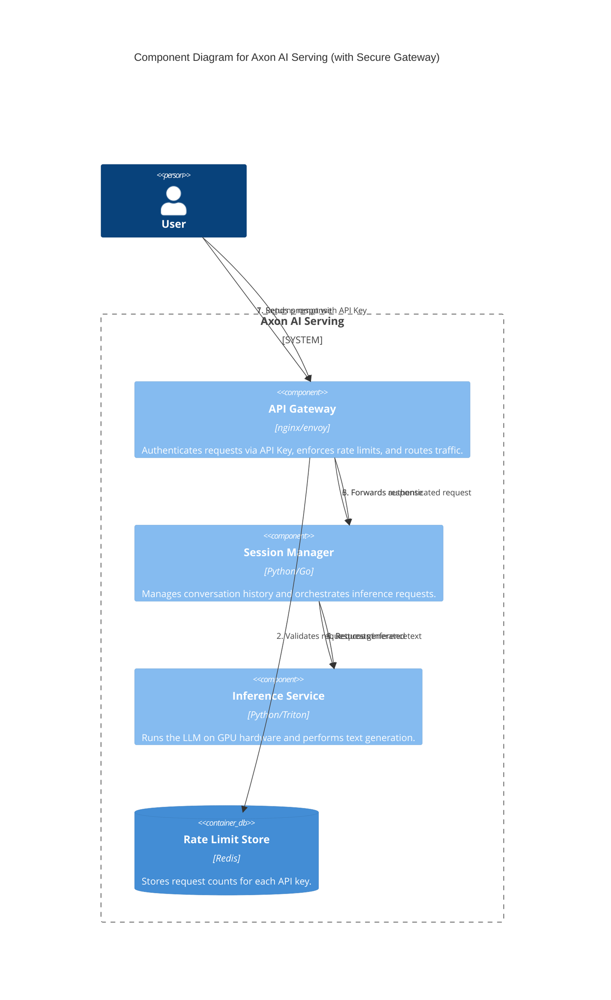
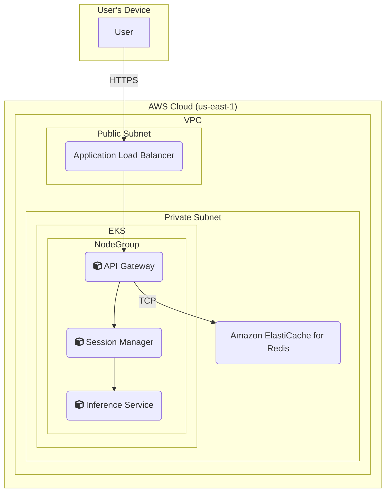

### **Design Secure API Gateway with Rate Limiting**

*   **Problem:** The current system design lacks essential security and abuse-prevention mechanisms. Without authentication, we cannot identify users. Without rate limiting, a single user could overwhelm the service, degrading performance for everyone and leading to excessive costs. This addresses PRD requirements **FR3.1** and **FR3.2**.
*   **Solution:** Enhance the API Gateway to act as a security enforcement layer.
    1.  **Authentication:** The gateway will be responsible for validating an API Key from the `Authorization` header of every incoming request. Requests without a valid key will be rejected with a `401 Unauthorized` error.
    2.  **Rate Limiting:** Upon successful authentication, the gateway will apply a token-bucket rate-limiting algorithm on a per-API-key basis. It will use a centralized, high-speed data store (Redis) to maintain request counts for each key. If a user exceeds their limit, the gateway will reject the request with a `429 Too Many Requests` error.
*   **Trade-offs:**
    *   **Pros:** Centralizes security logic at the edge, simplifying the downstream services. Protects the expensive inference service from unnecessary load. Provides fair usage policies.
    *   **Cons:** Introduces a new dependency (Redis) which adds a small amount of operational overhead and a potential point of failure if not made highly available. There will be a minor latency increase for each request due to the Redis lookup for rate limit checking.

#### Logical View (C4 Component Diagram)

This updated diagram shows the API Gateway now performing authentication and rate limiting. The core flow remains the same, but the gateway's responsibilities are now more detailed.

#### Physical View (AWS Deployment Diagram)

The physical view is updated to include **Amazon ElastiCache for Redis**. This managed service will act as the high-performance, low-latency backend for our rate-limiting logic, accessible from the API Gateway pods within our EKS cluster.

#### Component-to-Resource Mapping Table

| Logical Component   | Physical Resource                               | Rationale                                                                                                                                                             |
| ------------------- | ----------------------------------------------- | --------------------------------------------------------------------------------------------------------------------------------------------------------------------- |
| API Gateway         | Container in EKS Cluster (e.g., Nginx Ingress)  | Manages ingress traffic. Nginx/Envoy Ingress controllers have mature, built-in capabilities for API key validation and can integrate with Redis for rate limiting.    |
| Session Manager     | Container in EKS Cluster                        | A stateless service ideal for containerization. Can be scaled independently of other components.                                                                      |
| Inference Service   | Container in EKS Cluster (on GPU-enabled nodes) | Requires GPU access. Containerization allows packaging the model, dependencies, and inference server.                                                                 |
| **Rate Limit Store**    | **Amazon ElastiCache for Redis**                | (New) A managed, in-memory key-value store. Provides the extremely low latency (<1ms) required for a high-performance rate-limiting check on every incoming request. |
