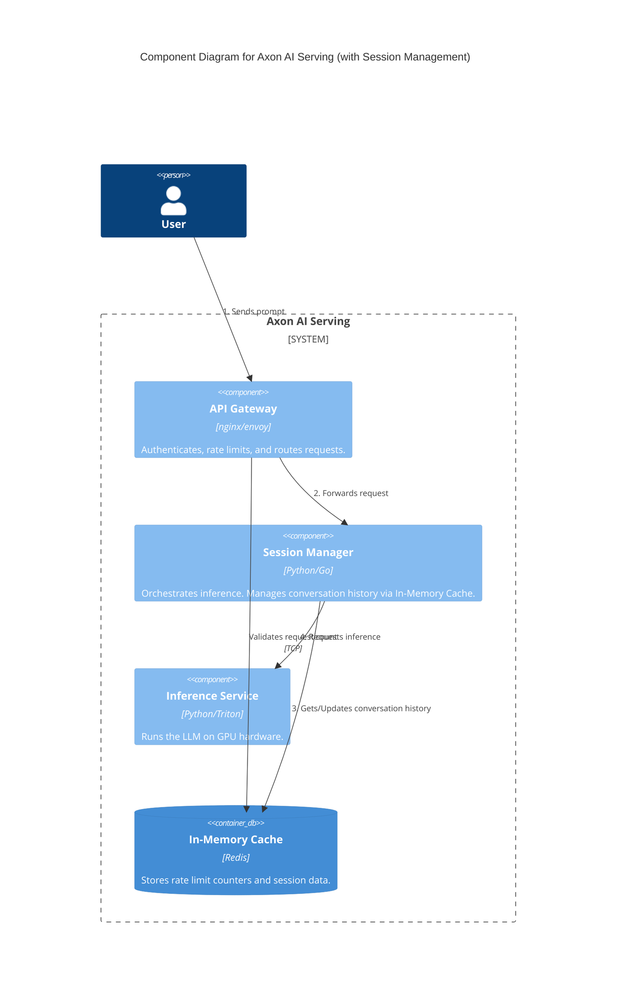
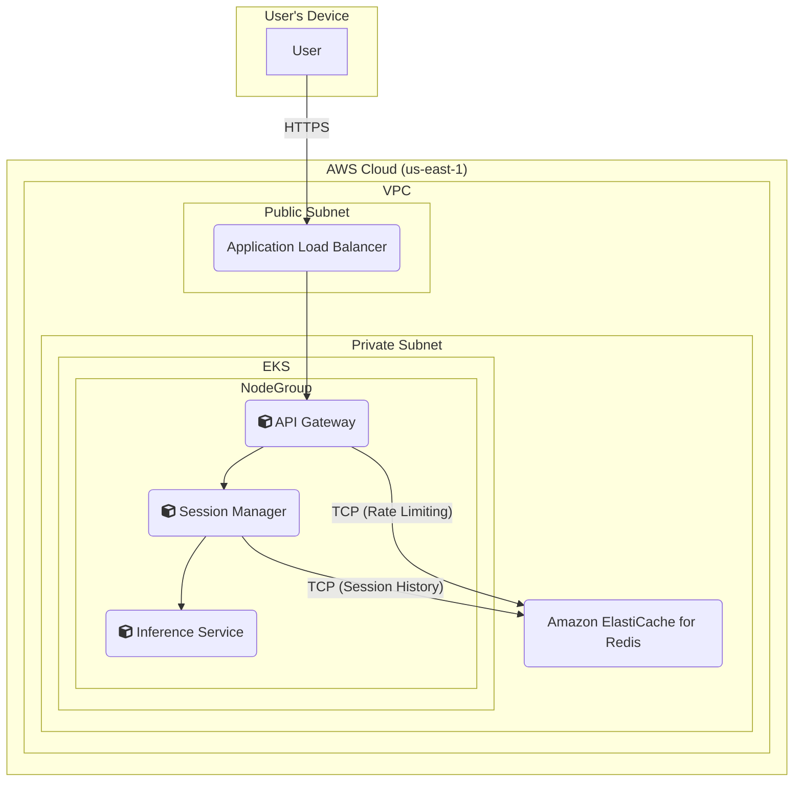

### **Design Session Management with In-Memory Caching**

*   **Problem:** To facilitate coherent, multi-turn conversations (a core requirement, **FR3**), the `Session Manager` must maintain the history of messages for each user session. A stateless `Session Manager` cannot do this. Relying on a traditional, slow, disk-based database for every turn would introduce significant latency, violating our performance SLOs.
*   **Solution:** The `Session Manager` will be enhanced to use a high-speed, in-memory cache to store and retrieve conversation history. We will leverage the existing Redis cluster for this purpose. The workflow will be:
    1.  Upon receiving a request, the `Session Manager` extracts a `session_id`.
    2.  It queries Redis using the `session_id` as the key to fetch the existing message history.
    3.  It appends the new user message to the history before sending the full context to the Inference Service.
    4.  After receiving the model's response, it updates the session history in Redis with the new assistant message.
*   **Trade-offs:**
    *   **Pros:** Using Redis for session storage provides extremely fast read/write operations (sub-millisecond), which is essential for maintaining a low Time-to-First-Token (TTFT). It efficiently re-uses an existing piece of infrastructure, minimizing cost and operational complexity.
    *   **Cons:** Storing session data solely in an in-memory cache makes it volatile. A Redis node failure or restart would result in the loss of active conversation histories. This risk is acceptable for now and will be mitigated with a durable backup store in a future issue.

#### Logical View (C4 Component Diagram)

This diagram is updated to reflect the `Session Manager`'s new role in state management. The Redis component is now renamed to "In-Memory Cache" to represent its dual use for both rate limiting and session storage.

#### Physical View (AWS Deployment Diagram)

The physical diagram remains largely the same, but a new communication path is added to show that the `Session Manager` containers now also connect to the `Amazon ElastiCache for Redis` cluster to perform session lookups and updates.

#### Component-to-Resource Mapping Table

| Logical Component | Physical Resource | Rationale |
| :--- | :--- | :--- |
| API Gateway | Container in EKS Cluster (e.g., Nginx Ingress) | Manages ingress traffic and enforces security policies at the edge. |
| Session Manager | Container in EKS Cluster | Orchestrates the request flow and now connects to Redis to manage state. |
| Inference Service | Container in EKS Cluster (on GPU-enabled nodes) | Dedicated compute for model execution. Remains unaware of session management. |
| **In-Memory Cache** | **Amazon ElastiCache for Redis** | (Updated Rationale) Serves a dual purpose: provides a low-latency store for **both** rate limit counters accessed by the API Gateway **and** conversation history accessed by the Session Manager. |
