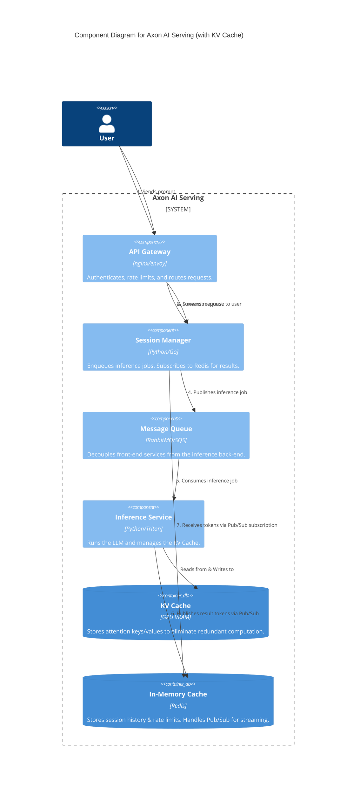
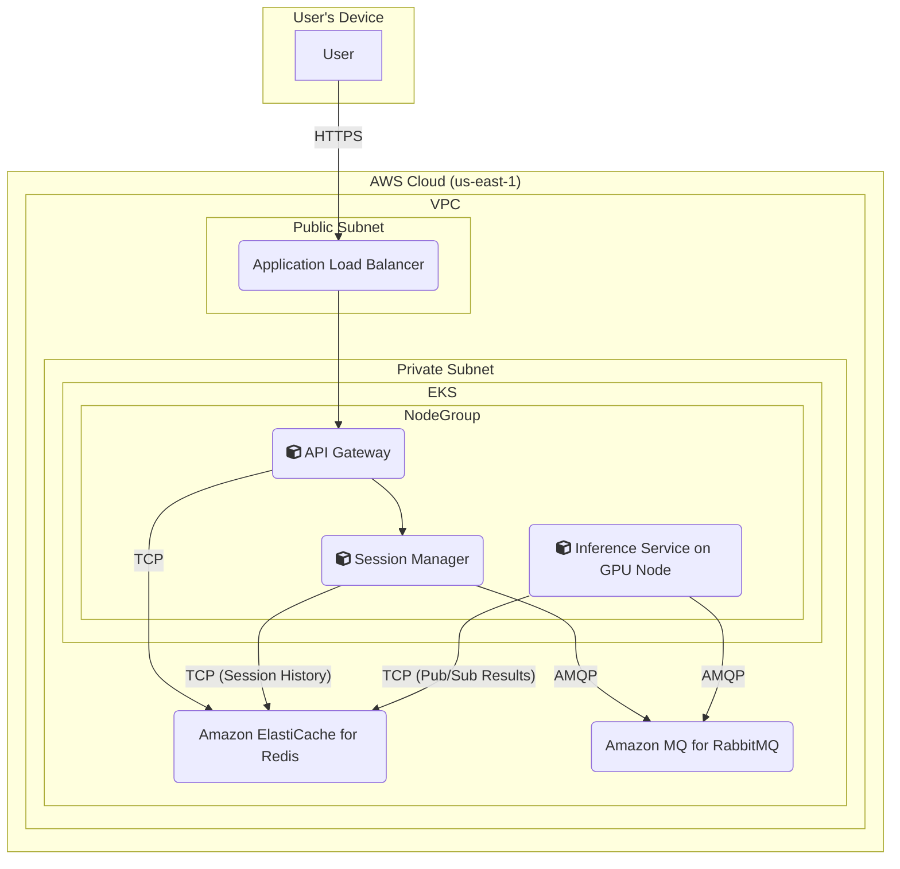

### **Implement KV Cache Optimization in Inference Service**

*   **Problem:** Without optimization, the Transformer model's attention mechanism is highly inefficient during text generation. For every single token it generates, it re-computes the attention scores over the entire input prompt and all previously generated tokens. This quadratic complexity leads to very high latency per token (TPOT) and severely limits the system's throughput, making it impossible to meet our performance SLOs (**SLO 1.2**).
*   **Solution:** The `Inference Service` will be redesigned to implement a **KV Cache**.
    1.  **Prefill Stage:** During the initial processing of the prompt, the service will compute the attention Keys (K) and Values (V) for all input tokens *once*.
    2.  **Caching:** These K and V tensors will be stored in a cache directly on the GPU's high-speed VRAM.
    3.  **Decode Stage:** For each subsequent token generation step, the model will only compute the K and V for the single newest token. It will then calculate attention using the new token's Query (Q) against the *entire set of cached Keys and Values*.
    This avoids re-computing the K and V tensors for the context, changing the expensive part of the operation from O(n²) to O(n) for each new token.
*   **Trade-offs:**
    *   **Pros:** Dramatically reduces the latency per output token (TPOT), leading to a significant increase in overall throughput and a much better user experience for streaming. This is a non-negotiable optimization for any serious LLM serving system.
    *   **Cons:** The KV Cache consumes a large amount of GPU VRAM. The memory required is proportional to `(batch_size * sequence_length * num_layers * hidden_size)`, which can quickly become the primary bottleneck limiting the number of concurrent requests the system can handle.

#### Logical View (C4 Component Diagram)

This view is architecturally similar to the previous one, as the KV Cache is an *internal optimization* within the Inference Service. The key change is updating the component's description and adding an internal container to visualize this critical detail.

#### Physical View (AWS Deployment Diagram)

The physical infrastructure diagram does **not change** for this issue. The KV Cache is not a separate external service; it is a data structure that resides in the memory (VRAM) of the GPU attached to the EKS worker node where the `Inference Service` container is running. The existing diagram already represents this colocation.

#### Component-to-Resource Mapping Table

| Logical Component | Physical Resource | Rationale |
| :--- | :--- | :--- |
| API Gateway | Container in EKS Cluster (e.g., Nginx Ingress) | Manages ingress traffic and enforces security policies at the edge. |
| Session Manager | Container in EKS Cluster | Producer: Enqueues inference jobs. Subscriber: Listens for streaming results on Redis. |
| Message Queue | Amazon MQ for RabbitMQ | A managed, highly available message broker that provides a durable buffer. |
| **Inference Service** | Container in EKS Cluster on **GPU-enabled nodes** (e.g., EC2 P4/P5 instances) | (Updated Rationale) GPU nodes are chosen for their massively parallel compute capabilities and, critically, for their **high-bandwidth memory (VRAM)** which is required to store the model weights and the performance-critical **KV Cache**. |
| In-Memory Cache | Amazon ElastiCache for Redis | Serves as the high-speed store for rate limiting, session history, and the Pub/Sub messaging for streaming results. |
