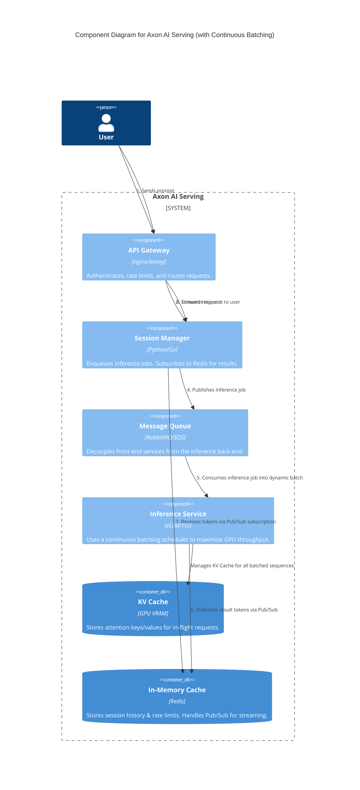
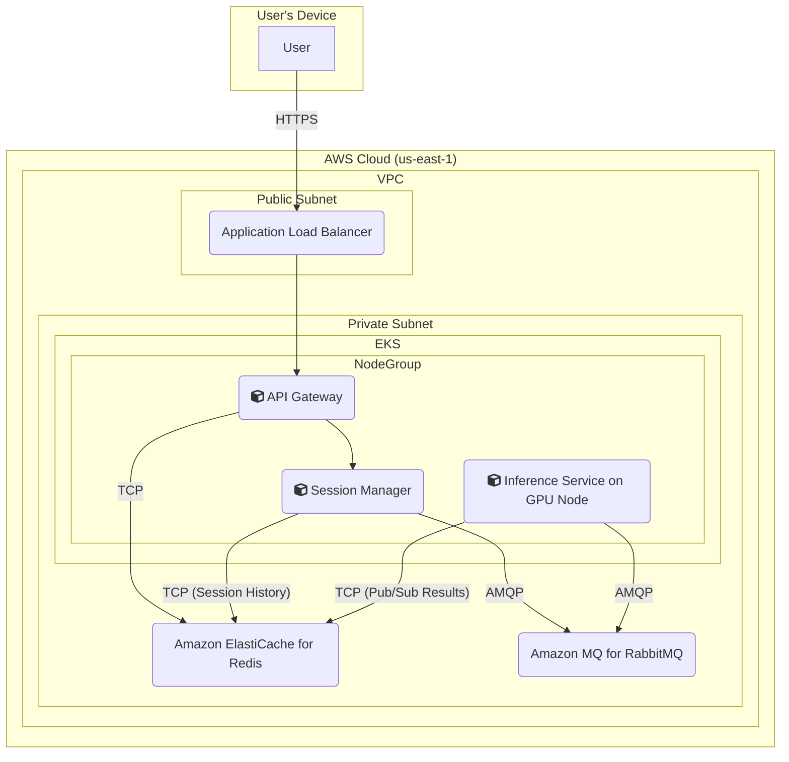

### **Design Throughput Maximization with Continuous Batching**

*   **Problem:** While KV Caching optimizes the computation for individual sequences, a naive "static batching" approach still wastes significant GPU resources. In a static batch, the entire batch must wait for the single longest sequence to complete before the next batch can be processed. This creates "bubbles" of GPU idle time, reducing overall throughput and failing to meet our high-utilization SLOs (**SLO 2.1, SLO 2.2**).
*   **Solution:** Evolve the internal scheduler of the `Inference Service` to implement **Continuous Batching**.
    1.  The scheduler will manage a constantly running, dynamic batch of requests.
    2.  After each model iteration, it will identify and remove any requests that have completed their generation.
    3.  It will then immediately pull new requests from the `Message Queue` to fill the empty slots in the batch before starting the next iteration.
    This approach ensures the GPU is processing a full or near-full batch on almost every forward pass, maximizing hardware utilization and token throughput.
*   **Trade-offs:**
    *   **Pros:** Massively increases GPU utilization and overall system throughput, often by 2-3x or more compared to static batching. It is a critical technique for building a cost-effective, high-performance service.
    *   **Cons:** The scheduling logic within the `Inference Service` becomes significantly more complex. It must now manage the state of many in-flight requests, handle dynamic additions/removals, and correctly map requests to their corresponding KV caches in VRAM. This complexity is often handled by specialized serving frameworks like vLLM or Text Generation Inference (TGI).

#### Logical View (C4 Component Diagram)

The implementation of continuous batching is an internal enhancement to the `Inference Service`. It does not change the high-level interactions between the main components. Therefore, the diagram's structure remains the same as in the previous issue, but the description of the `Inference Service` is updated to reflect its more advanced capability.

#### Physical View (AWS Deployment Diagram)

This is a software-level optimization. It does not introduce new infrastructure components. Therefore, the physical view remains identical to the one from Issue #5.

#### Component-to-Resource Mapping Table

| Logical Component | Physical Resource | Rationale |
| :--- | :--- | :--- |
| API Gateway | Container in EKS Cluster (e.g., Nginx Ingress) | Manages ingress traffic and enforces security policies at the edge. |
| Session Manager | Container in EKS Cluster | Enqueues inference jobs and manages the lifecycle of a user request. |
| Message Queue | Amazon MQ for RabbitMQ | Provides a durable buffer, enabling asynchronous processing and independent scaling. |
| **Inference Service** | Container in EKS Cluster on GPU-enabled nodes (e.g., EC2 P4/P5 instances) | (Updated Rationale) Utilizes specialized serving frameworks like **vLLM or TGI** that implement **continuous batching** schedulers. This software choice is critical to maximizing the throughput of the underlying GPU hardware. |
| KV Cache | GPU VRAM on the worker node | A data structure managed by the inference framework, residing in the fastest possible memory available to the model. |
| In-Memory Cache | Amazon ElastiCache for Redis | High-speed store for rate limiting, session history, and Pub/Sub messaging. |
