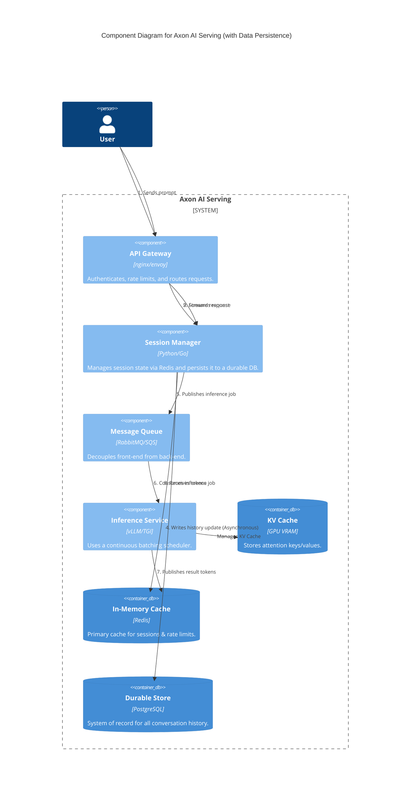
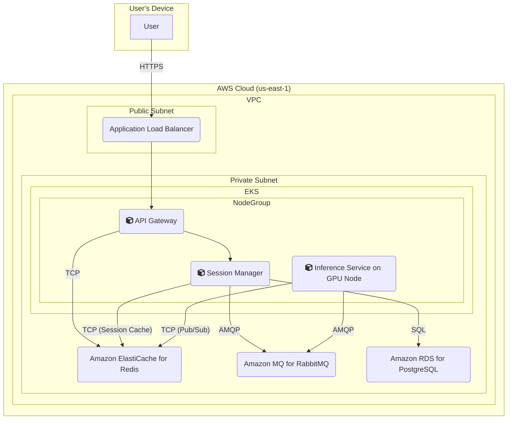

### **Design Data Persistence with a Write-Ahead Log (WAL)**

*   **Problem:** Currently, conversation histories are stored exclusively in Redis. As an in-memory cache, Redis is volatile. A service restart or node failure would cause all active conversation data to be permanently lost. This violates our reliability requirements (**NFR3**) and would lead to a poor user experience.
*   **Solution:** Introduce a durable, persistent database to serve as the system of record for conversation history. The `Session Manager` will use a **Write-Ahead Log (WAL)** pattern to ensure both performance and durability:
    1.  When a new message is processed, the `Session Manager` writes the update to the fast Redis cache first, ensuring the API response remains fast.
    2.  Simultaneously or immediately after, it pushes the same update to an asynchronous task queue or logs it locally to be written to a durable database (e.g., PostgreSQL) in the background.
    This pattern ensures that reads are always fast (from cache) and writes are durable without blocking the main request path. In the event of a Redis failure, the cache can be repopulated from the durable store.
*   **Trade-offs:**
    *   **Pros:** Achieves high data durability and system reliability. Protects against data loss for a critical user-facing feature.
    *   **Cons:** Adds another major infrastructure component (a relational database), which increases cost and operational load (e.g., managing backups, connections, schema). The architecture becomes more complex with the addition of the asynchronous write-back logic.

#### Logical View (C4 Component Diagram)

This diagram adds a new `Durable Store` component. The `Session Manager` now has two data-related interactions: a fast synchronous read/write to the `In-Memory Cache` for performance, and a slower, asynchronous "write-behind" to the `Durable Store` for reliability.

#### Physical View (AWS Deployment Diagram)

The physical view is updated to include **Amazon RDS for PostgreSQL**, a managed relational database service. This new service resides in the private subnet and is accessed by the `Session Manager` pods.

#### Component-to-Resource Mapping Table

| Logical Component | Physical Resource | Rationale |
| :--- | :--- | :--- |
| API Gateway | Container in EKS Cluster (e.g., Nginx Ingress) | Manages ingress traffic and enforces security policies at the edge. |
| Session Manager | Container in EKS Cluster | Manages session state, using Redis for low-latency reads and asynchronously writing to RDS for durability. |
| Message Queue | Amazon MQ for RabbitMQ | Provides a durable buffer, enabling asynchronous processing and independent scaling. |
| Inference Service | Container in EKS Cluster on GPU-enabled nodes | Utilizes specialized frameworks (vLLM/TGI) with continuous batching to maximize GPU throughput. |
| KV Cache | GPU VRAM on the worker node | A data structure managed by the inference framework for maximum performance. |
| In-Memory Cache | Amazon ElastiCache for Redis | High-speed store for rate limiting, session history, and Pub/Sub messaging. |
| **Durable Store** | **Amazon RDS for PostgreSQL** | (New) A fully managed, reliable, and scalable relational database service. It serves as the definitive system of record for conversation data, ensuring durability. |
