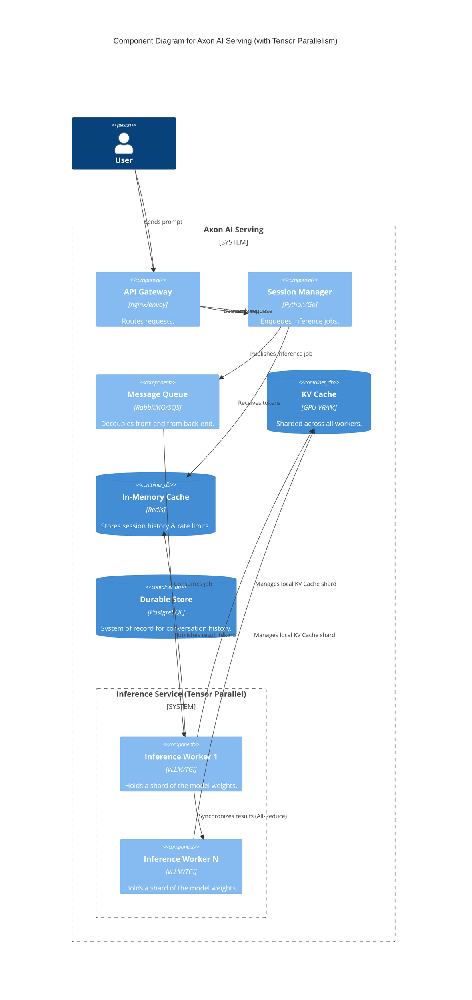
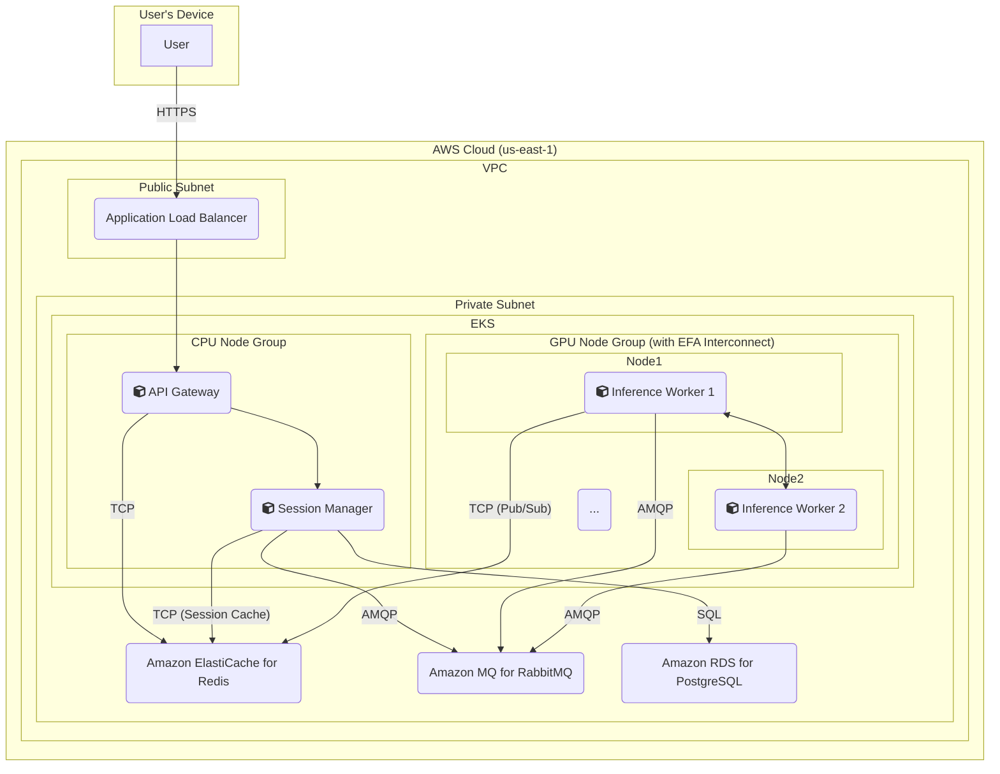

### **Design Support for Large Models with Tensor Parallelism**

*   **Problem:** High-performance LLMs, such as the Llama 3 70B model mentioned in our requirements, often exceed the VRAM capacity of a single GPU. For example, a 70B parameter model requires ~140GB for weights in FP16, while a standard A100 GPU has only 80GB. Our current architecture, which assumes a model fits on one device, cannot serve these larger, more powerful models.
*   **Solution:** We will enhance the `Inference Service` to support **Tensor Parallelism**. This model parallelism technique shards the individual weight matrices (tensors) of the LLM across a group of GPUs.
    1.  A single logical `Inference Service` will now be composed of a pool of `Inference Worker` containers, each running on a separate GPU.
    2.  During a forward pass, each worker computes its part of the operation on its local slice of the model's weights.
    3.  The workers then use a high-speed interconnect (e.g., NVLink, AWS EFA) to execute an `all-reduce` collective communication operation, synchronizing their partial results to form the final correct output for that model layer.
    This allows the aggregated VRAM of multiple GPUs to host a single, massive model.
*   **Trade-offs:**
    *   **Pros:** Unlocks the ability to serve state-of-the-art models that are too large for any single accelerator, which is a critical business capability.
    *   **Cons:** Introduces significant communication overhead and latency due to the inter-GPU `all-reduce` operations. This requires specialized, expensive hardware with high-speed interconnects to be effective. Deployments become more complex as a single "inference endpoint" is now a tightly coupled group of containers that must be managed as a single unit.

#### Logical View (C4 Component Diagram)

The external view of the `Inference Service` remains the same, but we update its internal structure to show that it is now a composite of multiple workers. This illustrates the parallelism that is happening "under the hood."

#### Physical View (AWS Deployment Diagram)

The physical view now explicitly shows a dedicated pool of GPU instances that are optimized for high-speed interconnects, such as **EC2 P4d instances equipped with Elastic Fabric Adapter (EFA)**. A single inference request for a large model will now be processed by multiple containers running across this pool.

#### Component-to-Resource Mapping Table

| Logical Component | Physical Resource | Rationale |
| :--- | :--- | :--- |
| API Gateway | Container on EKS CPU Node Group | Standard compute, no need for expensive GPU resources. |
| Session Manager | Container on EKS CPU Node Group | Standard compute, no need for expensive GPU resources. |
| Message Queue | Amazon MQ for RabbitMQ | Managed message broker for decoupling. |
| **Inference Service** | A pool of **Inference Worker** containers deployed across a dedicated **EKS GPU Node Group (e.g., EC2 P4d instances with EFA)** | (Updated Rationale) For models larger than a single GPU, we use a pool of specialized nodes. **EC2 P4d instances** are chosen because they provide multiple A100 GPUs and support **Elastic Fabric Adapter (EFA)**, which enables the low-latency, high-bandwidth interconnect required for efficient Tensor Parallelism. |
| KV Cache | GPU VRAM on each worker node in the GPU pool | The KV cache itself is now sharded. Each worker manages the cache for its portion of the batch. |
| In-Memory Cache | Amazon ElastiCache for Redis | High-speed store for session management and results communication. |
| Durable Store | Amazon RDS for PostgreSQL | Managed relational database for durable storage of conversation history. |
