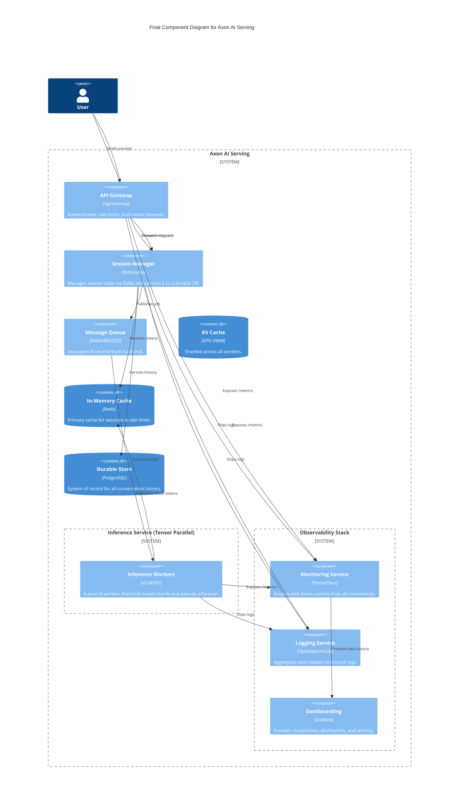
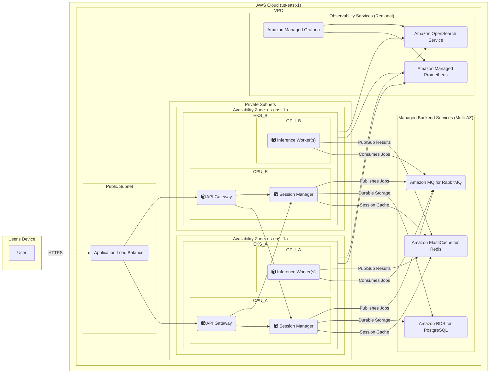

### **Finalize Production Deployment View with High Availability and Observability**

*   **Problem:** Our current design, while functionally complete and performant, has not explicitly addressed resilience against large-scale infrastructure failures (like an entire data center outage) or the need for a comprehensive monitoring and logging solution. These are non-negotiable requirements for a production-grade service (**NFR3, NFR4, NFR5**).
*   **Solution:** We will finalize the architecture by incorporating High Availability (HA) and a dedicated Observability stack.
    1.  **High Availability:** The entire infrastructure will be designed as a multi-Availability Zone (Multi-AZ) deployment. All stateful and stateless components will be replicated across at least two separate physical data centers to ensure the service remains operational even if one AZ fails.
    2.  **Observability Stack:** We will introduce a standard monitoring and logging stack. All services will be instrumented to export metrics to a central `Monitoring Service` (Prometheus), and structured logs will be shipped to a `Logging Service` (OpenSearch). A `Dashboarding Service` (Grafana) will be used for visualization and alerting.
*   **Trade-offs:**
    *   **Pros:** The final design is highly resilient, fault-tolerant, and fully observable, meeting the stringent requirements for a production system. System health can be monitored in real-time, and issues can be diagnosed quickly.
    *   **Cons:** A multi-AZ deployment significantly increases infrastructure cost, as many components are now duplicated. A full observability stack also adds to the operational cost and management overhead.

#### Logical View (C4 Component Diagram) - FINAL

This is the final, complete logical diagram. It adds the key components of our observability stack and shows them gathering data from our core application services.

#### Physical View (AWS Deployment Diagram) - FINAL

This is our final production deployment diagram. It shows the complete architecture deployed across two Availability Zones for high availability and includes the managed AWS services for our observability stack.

#### Component-to-Resource Mapping Table - FINAL

| Logical Component | Physical Resource | Rationale |
| :--- | :--- | :--- |
| API Gateway | Containers on EKS CPU Node Group (Multi-AZ) | Deployed across multiple AZs for high availability. |
| Session Manager | Containers on EKS CPU Node Group (Multi-AZ) | Deployed across multiple AZs for high availability. |
| Message Queue | Amazon MQ for RabbitMQ (Multi-AZ) | Managed broker configured in a primary/standby setup for fault tolerance. |
| Inference Service | Containers on EKS GPU Node Group with EFA (Multi-AZ) | GPU worker pools are spread across AZs to ensure inference capacity is always available. EFA enables high-performance inter-node communication. |
| KV Cache | GPU VRAM on each worker node | A distributed, in-memory cache managed by the inference framework. |
| In-Memory Cache | Amazon ElastiCache for Redis (Multi-AZ) | Managed cache configured with a primary and replica node in different AZs for failover. |
| Durable Store | Amazon RDS for PostgreSQL (Multi-AZ) | Managed database configured in a primary/standby setup for high availability and data durability. |
| **Monitoring Service** | **Amazon Managed Service for Prometheus (AMP)** | (New) A fully managed Prometheus-compatible service that handles the ingestion, storage, and querying of metrics at scale without manual overhead. |
| **Logging Service** | **Amazon OpenSearch Service** | (New) A managed service for log aggregation and analysis, providing powerful search and filtering capabilities for debugging. |
| **Dashboarding** | **Amazon Managed Grafana (AMG)** | (New) A managed Grafana instance for creating dashboards and alerts, tightly integrated with AMP and AOS as data sources. |
