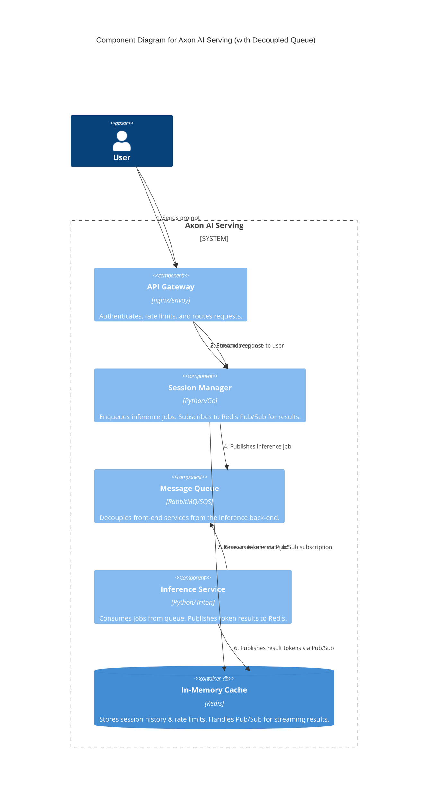
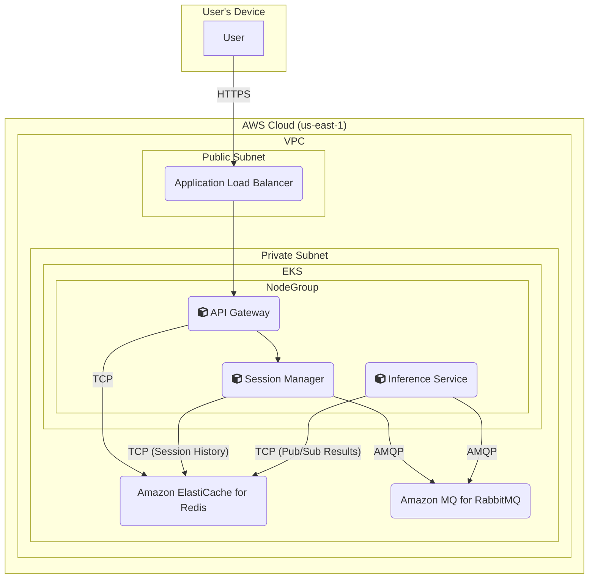

### **Design Decoupled Inference via a Message Queue**

*   **Problem:** The current synchronous, direct-call architecture between the `Session Manager` and the `Inference Service` creates a tight coupling. A surge in requests or slowness in the `Inference Service` will cause backpressure, making the entire system slow and unresponsive. This design prevents the front-end services and the resource-intensive back-end services from scaling independently, failing to meet our scalability and resilience requirements (**NFR3, SLO 4.1**).
*   **Solution:** Introduce an asynchronous message queue to decouple the request-handling logic from the inference-processing logic.
    1.  The `Session Manager` will now act as a **Producer**. Instead of calling the `Inference Service` directly, it will publish a job to a dedicated `inference_jobs` queue.
    2.  The `Inference Service` will act as a **Consumer**, pulling jobs from the queue at a sustainable pace.
    3.  To handle streaming responses, the `Session Manager` will maintain the open HTTP connection with the client. The `Inference Service` will publish generated tokens to a unique, request-specific channel in Redis (using its Pub/Sub capabilities). The `Session Manager` subscribes to this channel and forwards the tokens to the client.
*   **Trade-offs:**
    *   **Pros:**
        *   **Scalability:** Front-end and back-end services can be scaled independently based on their specific loads.
        *   **Resilience:** The queue acts as a durable buffer, preventing request loss if the inference workers are temporarily unavailable.
        *   **Responsiveness:** The user-facing `Session Manager` can acknowledge requests quickly after enqueuing them, without waiting for inference to complete.
    *   **Cons:**
        *   **Increased Architectural Complexity:** Adds a new core component (the message broker) that requires management and monitoring.
        *   **New Communication Pattern:** Requires implementing a Pub/Sub pattern in Redis to handle the return path for streaming, which adds complexity to the `Session Manager` and `Inference Service`.

#### Logical View (C4 Component Diagram)

This diagram introduces the `Message Queue` as a broker between the `Session Manager` and `Inference Service`. Note the flow is now asynchronous: the `Session Manager` sends a job and the `Inference Service` consumes it. The return path for streaming is handled via Redis Pub/Sub.

#### Physical View (AWS Deployment Diagram)

The physical view is updated to include **Amazon MQ for RabbitMQ**, a managed message broker service. This broker sits in the private subnet. The `Session Manager` pods will now establish connections to publish messages to it, and the `Inference Service` pods will connect to consume them.

#### Component-to-Resource Mapping Table

| Logical Component | Physical Resource | Rationale |
| :--- | :--- | :--- |
| API Gateway | Container in EKS Cluster (e.g., Nginx Ingress) | Manages ingress traffic and enforces security policies at the edge. |
| Session Manager | Container in EKS Cluster | **Producer:** Enqueues inference jobs. **Subscriber:** Listens for streaming results on Redis. |
| **Message Queue** | **Amazon MQ for RabbitMQ** | (New) A managed, highly available message broker that provides a durable buffer between producers and consumers, enabling independent scaling and resilience. |
| Inference Service | Container in EKS Cluster (on GPU-enabled nodes) | **Consumer:** Pulls jobs from RabbitMQ. **Publisher:** Pushes streaming results to Redis Pub/Sub. |
| In-Memory Cache | Amazon ElastiCache for Redis | (Updated Rationale) Continues to store rate limit and session data, and now also serves as the real-time messaging backbone for streaming tokens via its Pub/Sub functionality. |
